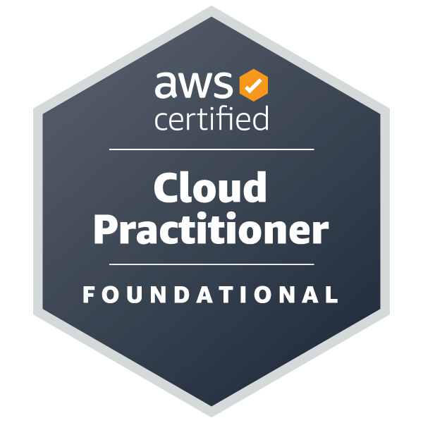
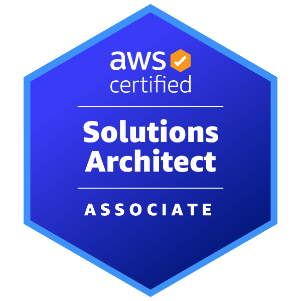
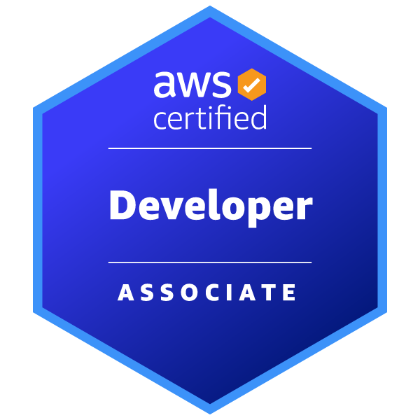

About me
------

I am a software engineer experienced in application development, configuration management, communication, and system design. My primary programming languages are Java and JavaScript, I have worked with many different technologies. I studied psychology for my bachelors, but while I was in school I came to the conclusion that I want to pursue software development when I finish. I'm a forever student who never wants to stop learning, and take joy in learning something new in many different domains. Integrity, honesty, and transparency are some of my core values. My other passions include music, investing, fitness, aviation, and meeting new people regardless of what walk of life they may come from. 

You can check out some of my current projects [here](/_pages/portfolio.html)

AWS Certifications
------

<a href="https://www.credly.com/badges/9b52c8c4-f8dc-473a-b9a9-8424e849b0da/public_url">
